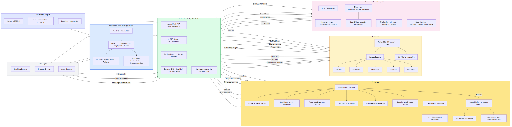

# AI Interview Platform — Level 0 (L0) System Architecture

**Document version:** 1.0  
**Codebase:** `resume-intelligence-platform` (Next.js 16 monolith)  
**Method:** Derived from source code inspection — not assumed from product naming  
**Last analyzed:** July 2026  

---

## Executive Summary

The AI Interview Platform is a **Next.js 16 full-stack monolith** that combines three product surfaces in one deployable unit:

1. **Candidate screening** — resume upload, AI suitability analysis, proctored mock interviews  
2. **Employee portal** — MCQ assessments, learning curriculum, proctored test recordings  
3. **Admin console** — HR ingestion pipeline (BR/JD/resume folders), employee test management, Excel exports  

Persistence is **Supabase PostgreSQL** (21 tables) plus **Supabase Storage** (5 buckets). The application does **not** use Next.js Server Actions or `middleware.ts`. Authentication is **custom HMAC-signed JWT** for employees and admins; Supabase Auth is referenced in one legacy admin route only.

Primary AI provider: **Google Gemini 2.0 Flash**. Secondary: **OpenAI** for JD structured extraction. Offline fallback: **LocalAIEngine** (rule-based heuristics, no external API).

---

## Architecture Diagram



> Source: [`architecture.mmd`](./architecture.mmd) — regenerate PNG with:  
> `npx @mermaid-js/mermaid-cli -i architecture.mmd -o architecture.png -b white -w 3200`

---

## 1. Client Layer

| Component | Technology | Evidence |
|-----------|------------|----------|
| Framework | **Next.js 16.2** App Router + **React 18.3** | `package.json`, `src/app/**/page.tsx` |
| UI styling | **Tailwind CSS 3.4**, **class-variance-authority**, **lucide-react** icons | `package.json`, `tailwind.config.*` |
| UI primitives | **Radix UI** (`@radix-ui/react-slot`), custom `src/components/ui/*` | `package.json`, components |
| Animation / charts | **Framer Motion 12**, **Recharts 3** | Admin analytics, employee dashboard |
| File upload UX | **react-dropzone** | Resume upload components |
| Browser targets | Modern browsers with **camera/microphone** (proctoring) | `Permissions-Policy` in `next.config.mjs` |

### Application Surfaces (Routes)

| Route | Audience | Purpose |
|-------|----------|---------|
| `/` | Candidate | Email-based interview access gate |
| `/interview/[id]` | Candidate | Proctored mock interview session |
| `/employee`, `/employee/dashboard` | Employee | Portal home and dashboard |
| `/employee/tests/[id]` | Employee | Timed MCQ assessment with proctoring |
| `/employee/learn`, `/employee/learn/[id]` | Employee | Learning curriculum + AI quiz |
| `/admin` | HR/Admin | Unified admin console (ingestion, resumes, employees) |
| `/admin/resumes/[id]` | Admin | Single resume detail view |

### Authentication (Client)

| Actor | Mechanism | Storage |
|-------|-----------|---------|
| **Admin** | `@infinite.com` email + `ADMIN_PASSWORD` → HMAC JWT (1 h TTL) | `localStorage` via `AdminAuthGate` |
| **Employee** | Employee ID + password → HMAC JWT (7 d TTL) | `localStorage` via `EmployeeAuthGate` |
| **Employee SSO** | Client posts email to `/api/employee/auth/outlook_sso` (auto-provisions if unknown) | Same JWT pattern — **no Microsoft OAuth SDK in codebase** |
| **Candidate** | Email lookup via `/api/interview/access` + session code on upload | Session-bound, no JWT |

---

## 2. Backend Layer

### API Routes (69 handlers)

All backend logic is exposed via **Next.js Route Handlers** under `src/app/api/`. There are **zero** `"use server"` Server Actions in `src/`.

#### Route groups

| Prefix | Count | Responsibility |
|--------|-------|----------------|
| `/api/resume/*` | 6 | Upload pipeline, parse, analyze, enhance, report, stream |
| `/api/interview/*` | 14 | Access, questions, answers, proctoring, video, ID verify, code run |
| `/api/admin/*` | 22 | Auth, resumes, JD, ingestion refresh, employees, exports, logs |
| `/api/employee/*` | 26 | Auth, tests, learning, analytics, video upload, assigned tests |
| `/api/health` | 1 | Health check |
| `/api/portal_settings` | 1 | Public portal settings read |
| `/api/upload` | 1 | Candidate resume upload with session validation |

### Services Layer (`src/services/`)

| Service | Responsibility |
|---------|----------------|
| `resume-service.ts` | Parse PDF/DOCX, AI analysis, Supabase `resumes` CRUD, storage |
| `interview-service.ts` | Question generation, answer evaluation, `interview_*` tables |
| `session-service.ts` | Candidate session codes and email binding |
| `automation-service.ts` | Folder scan ingestion (BR/JD/Resumes/Corp Pool), JD-to-BR Excel |
| `employee-account-store.ts` | Employee credentials in Supabase `employees` |
| `local-tests-db.ts` | Employee test state (Supabase `tests` + JSON fallback) |
| `resource-mapping-service.ts` | Reads `Resource_Question_Mapping.xlsx` for admin employee view |
| `employee-test-attempts-service.ts` | Per-question attempt details for admin export |
| `audit-log-service.ts` | Writes to `audit_logs` |
| `settings-service.ts` | `portal_settings` key-value store |
| `interview-csv-service.ts` | Interview CSV export/import helpers |
| `reset-log-service.ts` | Candidate reset audit trail |

### Middleware

**None.** No `middleware.ts` exists. Security checks are applied per-route:

- `src/lib/security.ts` — CSRF (origin/referer), IP rate limiting, file magic-byte validation  
- `src/lib/employee-auth.ts` — Bearer token verification on protected employee/admin APIs  

---

## 3. Database — Supabase PostgreSQL

**Client:** `@supabase/supabase-js` via `src/lib/db.ts`  
**Server access:** `SUPABASE_SERVICE_ROLE_KEY` (bypasses RLS in practice)  
**Schema source:** `docs/supabase-schema/master-azure-migration.sql`

### Domain model (21 tables + 1 view)

```
┌─────────────────────────────────────────────────────────────────┐
│ CANDIDATE SCREENING                                              │
│  resumes ─┬─ interview_questions                                │
│           ├─ interview_attempts                                   │
│           ├─ candidate_sessions                                   │
│           └─ (linked) candidate_interview_data                    │
├─────────────────────────────────────────────────────────────────┤
│ ADMIN / HR                                                       │
│  job_descriptions · simulated_emails · reset_logs                │
│  audit_logs · portal_settings                                    │
├─────────────────────────────────────────────────────────────────┤
│ EMPLOYEE PORTAL                                                  │
│  employees ─┬─ tests ─┬─ test_questions                          │
│              │         └─ test_attempts                           │
│              └─ (profile, passwords, XP, product flags)          │
│  VIEW: employee_test_results                                     │
├─────────────────────────────────────────────────────────────────┤
│ LEARNING CURRICULUM                                              │
│  learning_subjects → learning_modules → learning_topics          │
│                                        └─ learning_resources     │
├─────────────────────────────────────────────────────────────────┤
│ EFFECTIVENESS (Kirkpatrick — schema present)                     │
│  evaluations · behavior_evaluations · business_impacts           │
└─────────────────────────────────────────────────────────────────┘
```

### Key relationships

- `resumes.id` → `interview_questions.resume_id`, `interview_attempts.resume_id`, `candidate_sessions.resume_id`
- `employees.id` → `tests.employee_id` → `test_questions.test_id` → `test_attempts`
- `learning_subjects` → `learning_modules` → `learning_topics` → `learning_resources`

### Local fallback (non-production)

When `USE_SUPABASE_PRIMARY` / cloud flags are off, JSON files under `src/data/` and `uploads/` serve as dev fallback (`local_tests_db.json`, `employee-accounts.json`, `employee_test_manifest.json`).

---

## 4. Storage

### Supabase Storage buckets (created at runtime if missing)

| Bucket | Content | Access pattern |
|--------|---------|----------------|
| `resumes` | Uploaded candidate resume binaries | `resume-service.ts` — public bucket |
| `recordings` | Interview + employee test `.webm` videos | `employee-test-video.ts`, upload routes |
| `verifications` | Candidate ID/selfie images | `/api/interview/[id]/verify_id` |
| `app-data` | Runtime JSON (`employee_test_manifest.json`, `local_tests_db.json`) | `runtime-data.ts` |
| `docs-ingest` | BR, JD, Resumes, Corp Pool files (production/Vercel/Azure) | `docs-storage.ts` |

### Filesystem storage (environment-dependent)

| Path | When used |
|------|-----------|
| `uploads/` | Local dev writable root |
| `/tmp` | Vercel serverless ephemeral storage |
| `/app/uploads` | Azure Docker (`UPLOADS_DIR`) |
| `docs/BR`, `docs/JD`, etc. | Local dev doc ingestion |
| Repo root `.xlsx` | `Resource_Question_Mapping.xlsx`, `Employee_User_Credentials.xlsx` |

---

## 5. AI Services

### Google Gemini 2.0 Flash (`GEMINI_API_KEY`)

**SDK:** `@google/generative-ai` — `src/lib/gemini-ai.ts`  
**Model:** `gemini-2.0-flash`

| Use case | Code location |
|----------|---------------|
| Resume vs JD suitability scoring, executive summary, weaknesses | `geminiEngine.analyzeResume()` → `resume-service.ts` |
| Mock interview verbal + coding question generation | `interview-service.ts` → `generateQuestions()` |
| Verbal and coding answer scoring (1–10 + feedback) | `interview-service.ts` → `evaluateAnswer()` |
| Simulated code compiler / 3 test-case runner | `/api/interview/[id]/run_code` |
| Employee portal MCQ question generation | `learning-ai.ts` → `askGemini("generate_questions")` |
| Post-test AI analysis narrative | `learning-ai.ts` → `askGemini("analyse_results")` |
| Learning topic AI quiz generation | `learning-fallback.ts` → `fetchQuestionsFromAI()` |

### OpenAI (`OPENAI_API_KEY`)

**SDK:** `openai` — `src/lib/jd-to-br/aiService.ts`  
**Model:** Chat Completions (structured JSON extraction)

| Use case | Code location |
|----------|---------------|
| Job Description → structured fields for BR Excel generation | `extractJdDetails()` → `automation-service.ts`, `/api/admin/jd-to-br` |
| Fallback when key missing | Regex/mock dataset fallback in same file |

### LocalAIEngine (in-process — **not** an external LLM)

**File:** `src/lib/local-ai.ts`

| Use case | Trigger |
|----------|---------|
| Resume analysis when Gemini fails or quota exceeded | `resume-service.ts` catch block |
| Summary rewrite, bullet enhancement, suggestions | `resume-service.ts` enhance flow |

### Not present in codebase

- **Anthropic / Claude** — no imports or env vars  
- **Ollama** — no references  
- **Azure OpenAI** — not wired (only Azure Container deployment docs)  
- **@libsql/client** — listed in `package.json` but **not imported** in `src/` (legacy dependency)

---

## 6. External Services & Libraries

| Integration | Package / Tool | Purpose |
|-------------|----------------|---------|
| **Email (SMTP)** | `nodemailer` | Interview invite emails (`/api/admin/resumes/[id]/invite`), bulk employee credential dispatch (`/api/admin/employees/dispatch_mail`) |
| **PDF parsing** | `pdf-parse` | Extract text from uploaded PDFs |
| **DOCX parsing** | `mammoth` | Extract text from Word documents |
| **Excel** | `exceljs` | BR generation, admin exports, employee mapping reads |
| **Archives** | `adm-zip`, `jszip` | Bulk file handling in ingestion |
| **Face matching** | Python `faceproj/compare_images.py` + OpenCV Haar cascade | ID vs selfie biometric check (local subprocess, not cloud OCR) |
| **Supabase** | `@supabase/supabase-js` | Postgres + Storage API |
| **Analytics** | None — no Google Analytics, Segment, or similar in dependencies |

### Email environment variables

```
SMTP_HOST, SMTP_PORT, SMTP_USER, SMTP_PASS, SMTP_FROM
```

---

## 7. Data Flow

### 7.1 Candidate screening (primary flow)

```
Candidate Browser
  → POST /api/interview/access          (email → session lookup)
  → POST /api/upload                    (session code + PDF/DOCX)
       → validateFileSignature (magic bytes)
       → resume-service: pdf-parse / mammoth text extraction
       → resume-service: structured parse (regex/heuristics)
       → Gemini analyzeResume (or LocalAIEngine fallback)
       → INSERT resumes + UPLOAD Supabase resumes bucket
  → Admin: POST /api/admin/resumes/[id]/invite (optional SMTP email)
  → GET  /interview/[id]
       → POST /api/interview/[id]/start
       → interview-service: Gemini generateQuestions → interview_questions
       → POST /api/interview/[id]/submit_answer (per question)
            → Gemini evaluateAnswer → interview_attempts
       → POST /api/interview/[id]/run_code (coding questions)
       → POST /api/interview/[id]/upload_video → recordings bucket
       → POST /api/interview/[id]/verify_id → verifications bucket + Python face match
  → GET /api/resume/[id]/report          (aggregated report JSON)
```

### 7.2 Employee assessment flow

```
Employee Browser
  → POST /api/employee/auth/login       (HMAC JWT issued)
  → GET  /api/employee/assigned-test    (from Supabase tests / manifest)
  → POST /api/employee/tests/[id]/start (Gemini MCQ generation)
  → POST /api/employee/tests/[id]/submit
       → score calculation → test_attempts
       → askGemini("analyse_results") → tests.ai_analysis
  → Video chunks → recordings/employee-tests/{test_id}.webm
  → Admin: GET /api/admin/employee-tests/[testId]/attempts
  → Admin: POST /api/admin/employees/export-portal (ExcelJS)
```

### 7.3 Admin ingestion flow

```
Admin Browser
  → POST /api/admin/auth/login
  → POST /api/admin/refresh             (automation-service folder scan)
       → reads docs-ingest bucket OR local docs/
       → OpenAI extractJdDetails for JD files
       → ExcelJS BR workbook generation
  → POST /api/admin/upload_unified      (manual category upload)
```

---

## 8. Security

### Authentication & authorization

| Layer | Implementation |
|-------|----------------|
| Admin | Domain gate `@infinite.com` + shared password; JWT signed with `EMPLOYEE_AUTH_SECRET` |
| Employee | PBKDF2 password hash in DB/JSON; same HMAC JWT |
| API protection | `authenticateRequest()` / `verifyToken()` on employee routes |
| Candidate | Session code + email binding; one-time session use flag |
| Supabase Auth | Used only in `POST /api/employee/subjects` (admin subject creation) — **not** the primary auth path |

### Environment variables (secrets)

| Variable | Purpose |
|----------|---------|
| `NEXT_PUBLIC_SUPABASE_URL` | Supabase project URL |
| `NEXT_PUBLIC_SUPABASE_ANON_KEY` | Client-safe key (limited use) |
| `SUPABASE_SERVICE_ROLE_KEY` | Server-side DB + Storage (full access) |
| `EMPLOYEE_AUTH_SECRET` | HMAC JWT signing |
| `ADMIN_PASSWORD` | Admin console password |
| `GEMINI_API_KEY` | Google Generative AI |
| `OPENAI_API_KEY` | JD extraction (optional) |
| `SMTP_*` | Email delivery |

Production flags: `VERCEL=1`, `CONTAINER=1`, `USE_SUPABASE_PRIMARY=1`, `DOCS_USE_CLOUD=1`

### HTTP security headers

Configured in `next.config.mjs`: CSP, `X-Frame-Options: DENY`, HSTS, `X-Content-Type-Options`, Permissions-Policy for camera/microphone.

### Supabase RLS

RLS is **enabled** on all 21 tables with policies keyed to `auth.uid()` for employee self-read/write. The application server uses the **service role key**, which **bypasses RLS**. Policies matter only if Supabase Auth is adopted for direct client DB access.

### Rate limiting

In-memory sliding window per IP (`src/lib/security.ts`):
- Admin login: 5/min  
- Employee login: 10/min  
- Resume upload: 10/hour  

---

## 9. Deployment

| Tier | Target | Configuration |
|------|--------|---------------|
| **Frontend + Backend** | **Vercel** (primary) | `VERCEL=1`, serverless functions, `/tmp` uploads, `maxDuration=300` on heavy routes |
| **Frontend + Backend** | **Azure Container Apps** | `Dockerfile`, `output: standalone`, `CONTAINER=1`, port 3000 |
| **Database** | **Supabase PostgreSQL** | Managed Postgres; migratable to Azure Database for PostgreSQL per `master-azure-migration.sql` |
| **Object storage** | **Supabase Storage** | 5 buckets; Azure Blob noted as migration target in schema docs |
| **Local dev** | `npm run dev` | Local `uploads/`, local `docs/`, JSON fallbacks |

---

## 10. Technology Stack Summary

| Layer | Stack |
|-------|-------|
| Runtime | Node.js ≥ 18 |
| Framework | Next.js 16 (App Router, standalone output) |
| Language | TypeScript 5.6 |
| UI | React 18, Tailwind CSS, Radix UI, Framer Motion, Recharts |
| Database | Supabase PostgreSQL |
| Storage | Supabase Storage + filesystem |
| AI | Google Gemini 2.0 Flash, OpenAI (JD only), LocalAIEngine fallback |
| Email | Nodemailer + SMTP |
| Parsing | pdf-parse, mammoth, exceljs |
| Biometrics | Python + OpenCV (local) |
| CI/CD targets | Vercel, Azure Container Registry / Container Apps |

---

## Appendix: Component Responsibility Matrix

| Component | Primary responsibility |
|-----------|------------------------|
| `src/app/page.tsx` | Candidate entry / email gate |
| `src/app/admin/page.tsx` | Unified HR admin console |
| `src/app/employee/**` | Employee portal UI |
| `src/app/interview/[id]/page.tsx` | Live proctored interview UI |
| `resume-service.ts` | End-to-end resume intelligence pipeline |
| `interview-service.ts` | Mock interview orchestration |
| `automation-service.ts` | Document ingestion automation |
| `gemini-ai.ts` | Central Gemini client wrapper |
| `learning-ai.ts` | Employee test & quiz AI prompts |
| `runtime-data.ts` | Cloud/local JSON persistence bridge |
| `docs-storage.ts` | BR/JD/resume folder abstraction |
| `container-runtime.ts` | Vercel vs Azure vs local detection |

---

*This document reflects the codebase as of branch `feat/employee-portal-qb-updates`. Re-validate after major refactors.*
